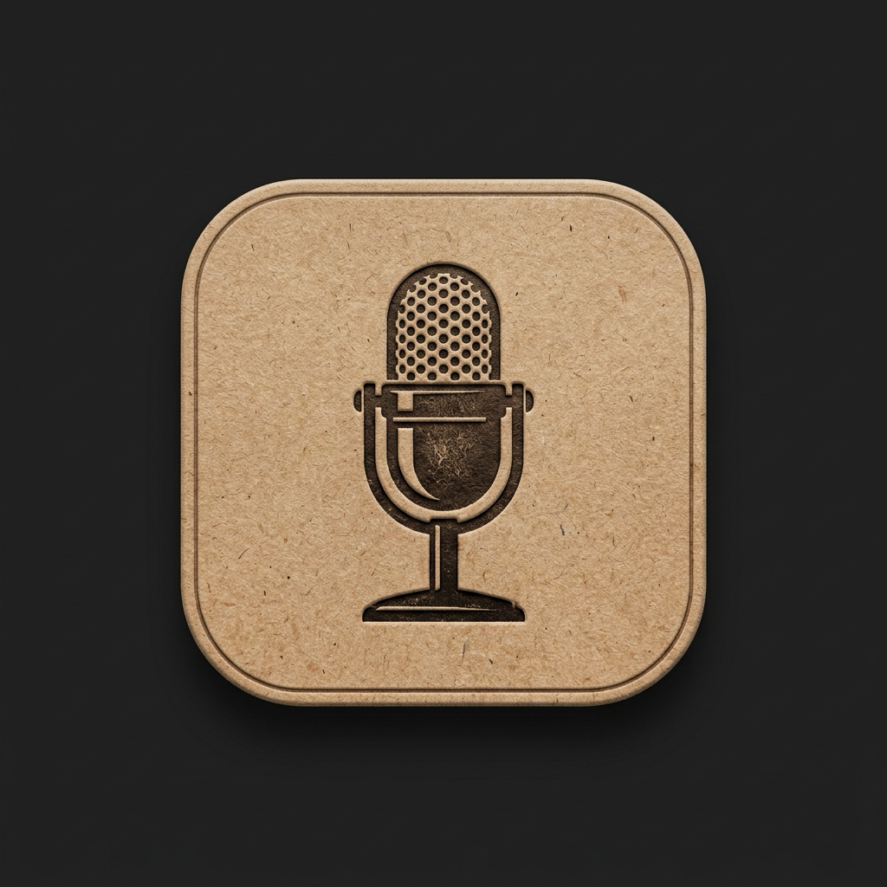
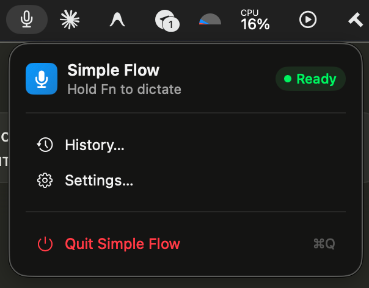
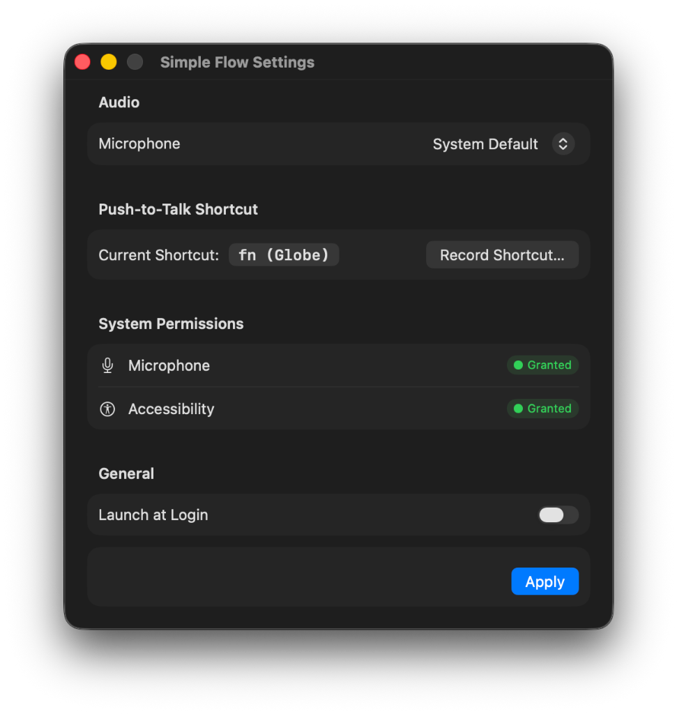

<div align="center">
  
  <h1>Simple Flow</h1>
  <p><strong>Lightweight push-to-talk voice dictation for macOS powered by custom remote AI models.</strong></p>
  <p>
    <a href="https://github.com/kirill-dev-pro/simple-flow/releases/latest"></a>
    
    
    
  </p>
  <p>
    📖 <strong>Read the Story:</strong> 
    <a href="https://kcrz.dev/blog/simple-flow-macos-dictation/">English</a> &bull; 
    <a href="https://kcrz.dev/blog/simple-flow-macos-dictation-ru/">Русский</a> &bull; 
    <a href="https://kcrz.dev/blog/simple-flow-macos-dictation-es/">Español</a> &bull; 
    <a href="https://kcrz.dev/blog/simple-flow-macos-dictation-de/">Deutsch</a> &bull; 
    <a href="https://kcrz.dev/blog/simple-flow-macos-dictation-fr/">Français</a> &bull; 
    <a href="https://kcrz.dev/blog/simple-flow-macos-dictation-zh/">中文</a> &bull; 
    🌐 <strong><a href="https://kcrz.dev">kcrz.dev</a></strong>
  </p>
</div>

---

## Overview

**Simple Flow** is a native macOS menu bar application designed for lightning-fast voice dictation. Hold down a global hotkey (`Fn / Globe`), speak your thought, release, and the transcribed text is immediately pasted right where your cursor is blinking — in your IDE, terminal, browser, or chat window.

It connects directly to your own remote OpenAI-compatible or custom transcription endpoint with your API token, bypassing the recurring subscriptions and rate limits of commercial tools.

> 💡 **Fun Fact**: Not a single line of Swift code in this repository was written by hand. The entire architecture, state machine, audio capture pipeline, settings interface, and build scripts were created in 2 prompts by **OpenAI Codex**. Read the full story on [kcrz.dev](https://kcrz.dev/blog/simple-flow-macos-dictation/).

---

## Key Features

- **Push-to-Talk Hotkey**: Hold `Fn` (Globe) or a custom recorded key combination to record; release to transcribe and paste.
- **Custom Remote Cloud Model**: Point to any remote transcription API endpoint with a secure Bearer token.
- **Zero-Lag Text Insertion**: Emulates synthetic `⌘V` keystrokes via `CGEvent` to instantly paste transcripts into the frontmost application.
- **Minimal Resource Footprint**:
  - **`0.0%` CPU** in idle (sleeps in `RunLoop`, waking only on `CGEventTap` hotkey interrupts).
  - **`~50 MB` RAM** baseline footprint.
- **Native Menu Bar Interface**: Live status indicator (`Ready` / `Recording`), transcription history, and a full Settings modal.
- **Secure by Default**: Stores your API token safely in the macOS system Keychain.

---

## Screenshots

<div align="center">
  
  &nbsp;&nbsp;&nbsp;&nbsp;
  
</div>

---

## How It Works

```
[ Hold Fn Key ] ──> Audio Buffer Recording (AVAudioRecorder)
        │
[ Release Key ] ──> Async REST API Upload (Custom Cloud Model)
        │
[ Transcription Result ] ──> Synthetic ⌘V Keystroke (CGEventSource) ──> Insert into Focus
```

Under the hood, all state transitions are managed by a pure, deterministic state machine (`DictationStateMachine`) ensuring that focus loss, cancellation with `Esc`, network failures, or rapid key presses are handled safely without dropped events or corrupted state.

---

## Installation

### Option 1: Download Release (Recommended)

1. Download the latest `SimpleFlow-v1.1.0.zip` from [**Releases**](https://github.com/kirill-dev-pro/simple-flow/releases/latest).
2. Unzip and drag `SimpleFlow.app` into your `/Applications` folder.
3. Open **Simple Flow** from Applications or Spotlight.
4. Open **Settings** from the menu bar item, enter your transcription server URL and API token, and grant the required system permissions.

### Option 2: Build from Source

Requirements: macOS 14.0+ and Xcode Command Line Tools (`swift --version` >= 6.0).

```bash
# Clone the repository
git clone https://github.com/kirill-dev-pro/simple-flow.git
cd simple-flow

# Build and package the release .app bundle
./scripts/build-app.sh release

# Copy to Applications
cp -R .build/SimpleFlow.app /Applications/
```

---

## System Permissions

To capture push-to-talk hotkeys and paste transcripts into active apps, macOS requires two permissions:

1. **Microphone**: Required to capture audio during dictation.
2. **Accessibility**: Required for `CGEventTap` to monitor global key presses and simulate `⌘V` paste commands into active windows.

Simple Flow prompts for these permissions automatically on first launch, or you can manage them in **System Settings → Privacy & Security**.

---

## Author

Created with Codex by **Kirill**
- Website: [kcrz.dev](https://kcrz.dev)
- X / Twitter: [@kcrz_dev](https://x.com/kcrz_dev)
- GitHub: [@kirill-dev-pro](https://github.com/kirill-dev-pro)

---

## License

This project is licensed under the [MIT License](LICENSE).
